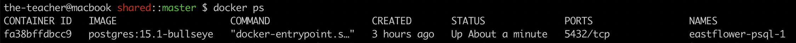

# Eastflower.ru

Personal Culinary Blog of Elena Tsoy.
# Cold Dev Start

```sh
PLATFORM=amd docker compose -f dev.docker-compose.yml pull
```

## 1. Remove `.gitkeep` file

```sh
rm db/PGSQL/.gitkeep
```

You need it to avoid a problem with Cold Run and Initialization of a new database (PSQL message: `If you want to create a new database system, either remove or empty the directory`)

## 2. Run PSQL container

```sh
cd docker

docker compose -f dev.docker-compose.yml up psql
```

New initial PSQL database will be created in `db/PGSQL`.

## 3. Restore `.gitkeep` file

Restore the `.gitkeep` that was removed recently.

From the root of the project.

```sh
touch db/PGSQL/.gitkeep
```

## 4. Put database backup file in `shared`

PSQL container has an access to the `shared` folder in the root folder of the application.

We sould like to use this folder to share files across containers.

```sh
cd shared

scp rails@123.60.120.180:/home/rails/DUMPS/eastflower.ru.2022_10_09_15_22.pq.sql .
```

## 5. Create Database inside `PSQL` container

Be sure that PSQL container is running, or restart it.

```sh
docker ps
```



```sh
!> eastflower-psql-1
eastflower-redis-1
eastflower-sphinx-1
eastflower-rails-1
```

```sh
docker exec eastflower-psql-1 bash /shared/create_eastflower_db.sh
```

## 5. Load the Database

```sh
!> eastflower-psql-1
eastflower-redis-1
eastflower-sphinx-1
eastflower-rails-1
```

```
docker exec eastflower-psql-1 bash -c "pg_restore -h localhost -d eastflower -U rails /shared/eastflower.ru.2022_10_09_15_22.pq.sql"
```
## 6. Create Search Index Config

```sh
PLATFORM=amd docker compose -f dev.docker-compose.yml up psql rails
```

```sh
!> eastflower-psql-1
eastflower-redis-1
eastflower-sphinx-1
!> eastflower-rails-1
```

```sh
docker exec -ti eastflower-rails-1 /bin/bash
```

```sh
$ cd home
$ rake ts:configure
```

## 7. Make the Search Index

```sh
docker compose -f dev.docker-compose.yml up
```

```sh
!> eastflower-psql-1
!> eastflower-redis-1
!> eastflower-sphinx-1
!> eastflower-rails-1
```

```sh
docker exec eastflower-sphinx-1 indexer --config /opt/sphinx/conf/sphinx.conf --all
```

## 8. Run the Project

```sh
docker compose -f dev.docker-compose.yml up
```

```sh
!> eastflower-psql-1
!> eastflower-redis-1
!> eastflower-sphinx-1
!> eastflower-rails-1
```

```sh
$ docker exec -ti eastflower-rails-1 /bin/bash
```

```sh
rails s -b 0.0.0.0 -p 3000
```

## 9. Download uploads

```sh
rsync -chavzPr rails@eastflower.ru:/home/rails/eastflower.ru/public/uploads .

rsync -chavzPr rails@eastflower.ru:/home/rails/eastflower.ru/public/uploads .
```

```
-c     skip based on checksum, not mod-time & size
-h     output numbers in a human-readable format
-a     archive mode is -rlptgoD (no -A,-X,-U,-N,-H)
-v     increase verbosity
-z     compress file data during the transfer
-P     keep partially transferred files
-r     recurse into directories
```
